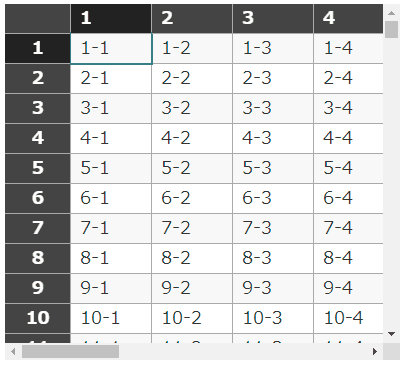

# EditTable
ブラウザでEXCELのような編集ができるJavaScriptライブラリです。

機能は最小限のもののみを実装。
他のライブラリには依存していないため、EditTable.jsだけあれば動作します。



デモ：[https://gearsns.github.io/EditTable/](https://gearsns.github.io/EditTable/)

## 動作環境
Chrome, Firefox(仮)

## 使用方法

* ライブラリのロード
	```html
	<script src="./EditTable.min.js"></script>
	```

* 動的生成
	```html
	<div id="t1"></div>
	<style>
		#t1 {
			position: relative;
			width: calc(100vw - 400px);
			height: 80vh;
		}
	</style>
	```

	```javascript
	<script>
		const et = document.createElement("edit-table");
		document.getElementById("t1").appendChild(et);
	</script>
	```

* 静的生成
	```html
	<div id="t2"><edit-table id="d1" new-row=true></edit-table></div>
	<style>
		#t2 {
			position: relative;
			width: calc(100vw - 400px);
			height: 80vh;
		}
	</style>
	```

	```javascript
	<script>
		const et = document.getElementById("t2");
	</script>
	```

* ヘッダ設定

	```javascript
	<script>
		let header = [];
		for (let j = 1; j <= 15; j++) {
			header.push(j);
		}
		et.setHeader(header);
	</script>
	```


* データ設定
	```javascript
	<script>
		let data = [];
		for (let i = 1; i <= 10; ++i) {
			let item = [];
			for (let j = 1; j <= 15; j++) {
				item.push(i + "-" + j);
			}
			data.push(item);
		}
		et.setData(data);
	</script>
	```
